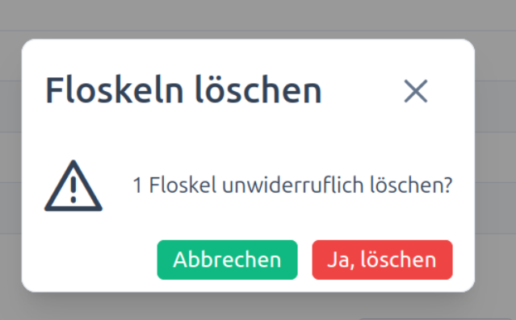

#  Floskeln löschen

## Ziel

Nicht mehr benötigte Floskeln sicher entfernen.

## Schritte

1. Öffnen Sie die Floskeln-Liste.
2. Suchen oder filtern Sie den zu löschenden Eintrag.
3. Starten Sie die Löschaktion.
4. Bestätigen Sie die Rückfrage.
5. Prüfen Sie, ob der Eintrag entfernt wurde.

## Sicherheitshinweis

Löschen Sie nur Einträge, die fachlich nicht mehr benötigt werden.

## Screenshots

---

| « [Floskeln filtern](floskeln-filtern.md) | [Inhaltsverzeichnis](../index.md) | [Floskeln importieren](floskeln-importieren.md) » |
|:---|:---:|---:|
