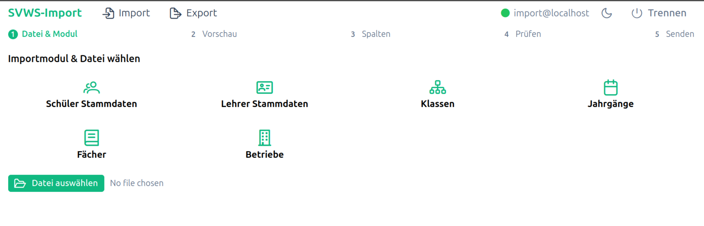
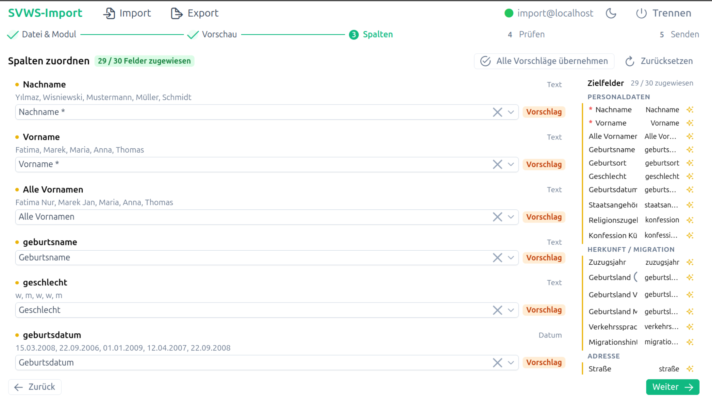
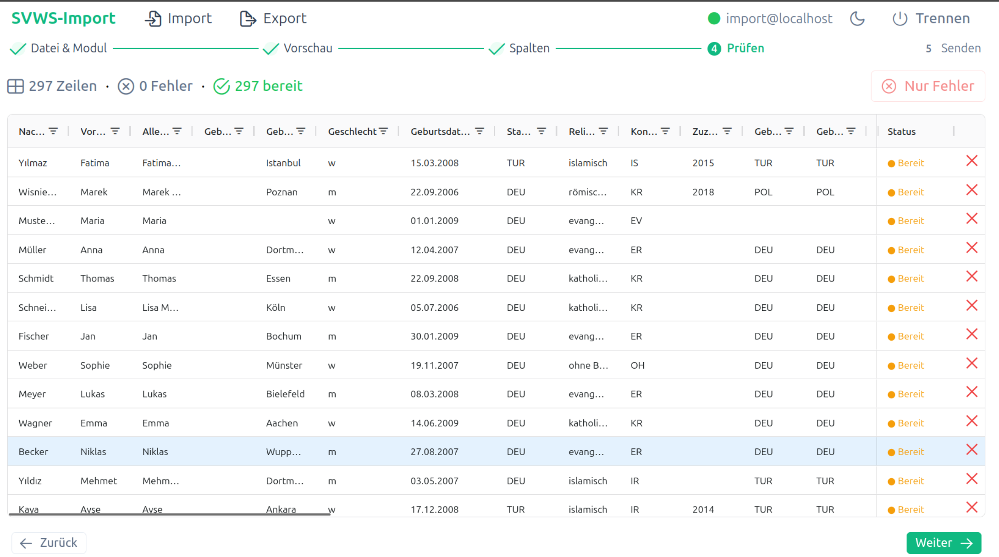
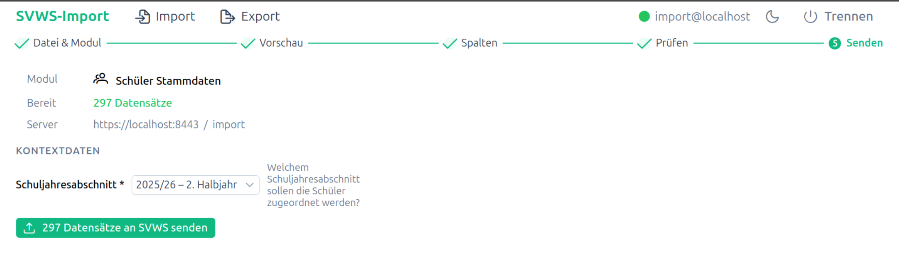

#  Import-Assistent nutzen (Schritt für Schritt)

## Ziel

Sie führen einen geführten Import in klaren Schritten durch.

## Schrittfolge im Assistenten

1. Importmodul wählen und Datei hochladen
2. Rohdatenvorschau kontrollieren
3. Spalten-Mapping anpassen
4. Validierung prüfen und Fehler korrigieren
5. Import senden und Ergebnis auswerten

## Hinweise zur Nutzung

- Bei unklaren Fehlern zuerst die Quelldatei prüfen.
- Kritische Felder immer manuell kontrollieren.
- Bei großen Datenmengen mit Testausschnitt starten.

## Screenshots

<nav style="display:flex;justify-content:space-between;margin-top:2rem;padding-top:1rem;border-top:1px solid var(--vp-c-divider)">
  <a href="lehrerdaten-anlegen.html">« Lehrerdaten anlegen</a>
  <a href="../index.html">Inhaltsverzeichnis</a>
  <a href="klassen-anlegen.html">Klassen anlegen »</a>
</nav>
