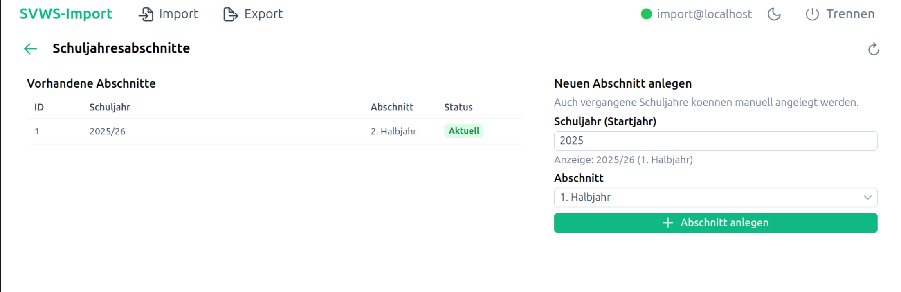

#  Neue Schuljahresabschnitte anlegen

## Ziel

Neue Schuljahresabschnitte in SVWS anlegen.

## Schritte

1. Öffnen Sie die Kachel Schuljahresabschnitte anlegen.
2. Wechseln Sie zur Funktion für neue Einträge.
3. Erfassen Sie die benötigten Werte für den Abschnitt.
4. Speichern Sie den neuen Eintrag.
5. Prüfen Sie, ob der Eintrag in der Liste erscheint.

## Prüfpunkte

- Schuljahr korrekt
- Abschnitt korrekt (z. B. 1 oder 2)
- Keine doppelten Kombinationen

## Screenshots

<nav style="display:flex;justify-content:space-between;margin-top:2rem;padding-top:1rem;border-top:1px solid var(--vp-c-divider)">
  <a href="schuljahresabschnitte-laden.html">« Schuljahresabschnitte laden</a>
  <a href="../index.html">Inhaltsverzeichnis</a>
  <a href="floskeln-anzeigen.html">Floskeln anzeigen »</a>
</nav>
