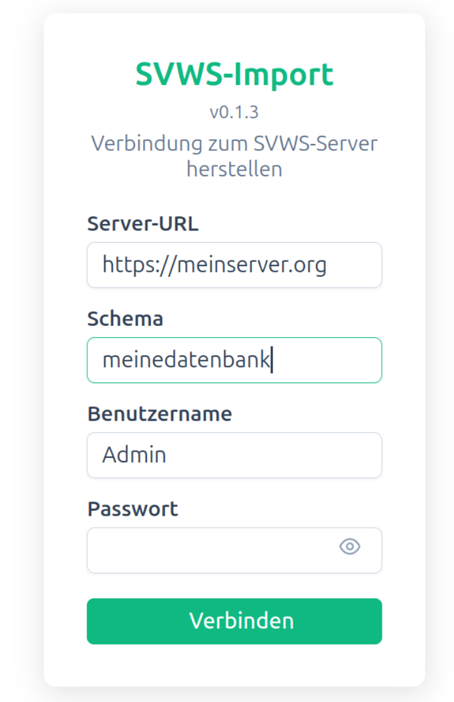
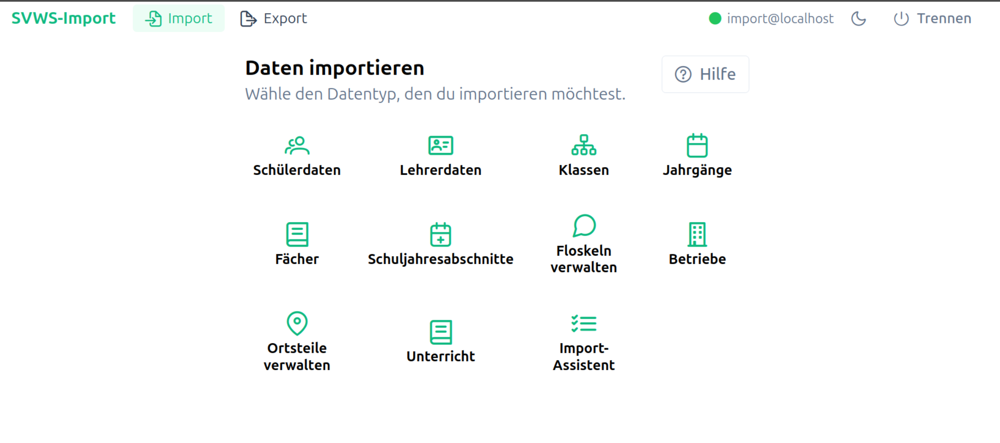

#  Verbindung zum SVWS-Server herstellen

## Ziel

Sie stellen eine gültige Verbindung zum SVWS-Server her, damit Importfunktionen genutzt werden können.

## Voraussetzungen

- Serveradresse ist bekannt
- Gültiger Benutzername und gültiges Passwort liegen vor
- Netzwerkzugang zum Server ist vorhanden

## Schritte

1. Öffnen Sie die Seite zum Verbinden.
2. Tragen Sie Serveradresse, Benutzername und Passwort ein.
3. Starten Sie die Verbindung.
4. Warten Sie auf die Rückmeldung.

## Erwartetes Ergebnis

- Verbindung wird als erfolgreich angezeigt.
- Die Importfunktionen sind anschließend nutzbar.

## Typische Probleme

- Falsche Serveradresse
- Falsche Zugangsdaten
- Server im Netzwerk nicht erreichbar

## Screenshots

<nav style="display:flex;justify-content:space-between;margin-top:2rem;padding-top:1rem;border-top:1px solid var(--vp-c-divider)">
  
  <a href="../index.html">Inhaltsverzeichnis</a>
  <a href="schuelerdaten-anlegen.html">Schülerdaten anlegen »</a>
</nav>
