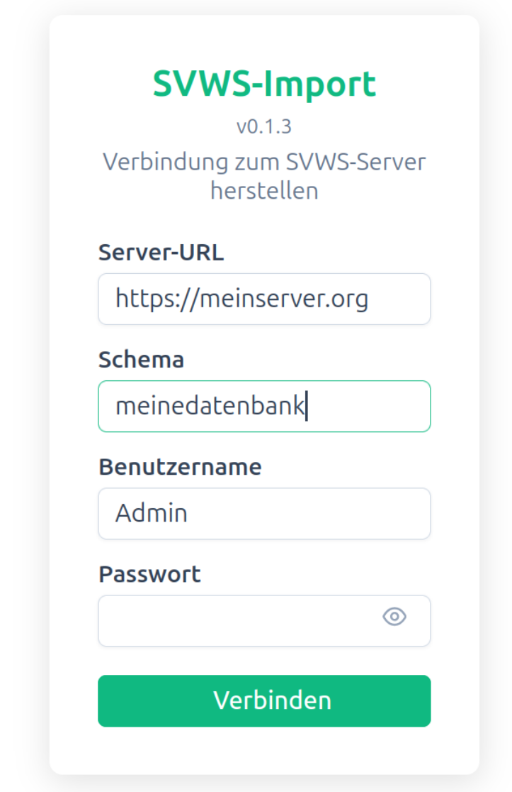
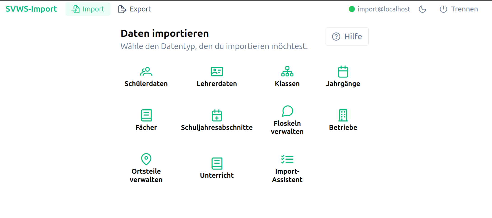

#  Verbindung zum SVWS-Server herstellen

## Ziel

Sie stellen eine gültige Verbindung zum SVWS-Server her, damit Importfunktionen genutzt werden können.

## Voraussetzungen

- Serveradresse ist bekannt
- Gültiger Benutzername und gültiges Passwort liegen vor
- Netzwerkzugang zum Server ist vorhanden

## Schritte

1. Öffnen Sie die Seite zum Verbinden.
2. Tragen Sie Serveradresse, Benutzername und Passwort ein.
3. Starten Sie die Verbindung.
4. Warten Sie auf die Rückmeldung.

## Erwartetes Ergebnis

- Verbindung wird als erfolgreich angezeigt.
- Die Importfunktionen sind anschließend nutzbar.

## Typische Probleme

- Falsche Serveradresse
- Falsche Zugangsdaten
- Server im Netzwerk nicht erreichbar
- Der Browser vertraut dem Zertifikat des SVWS-Servers nicht (häufig bei selbstsignierten Zertifikaten)

### Zertifikat des SVWS-Servers wird nicht vertraut

Läuft SVWS-Import im Browser (z. B. Chrome oder Edge) und nutzt der SVWS-Server ein selbstsigniertes Zertifikat, blockiert der Browser die Verbindung ohne sichtbare Warnung. SVWS-Import zeigt in diesem Fall einen Hinweis mit dem Link **„Server-Zertifikat im neuen Tab prüfen“**.

1. Klicken Sie auf den Link. Es öffnet sich ein neuer Tab mit einer Sicherheitswarnung.
2. Wählen Sie **„Erweitert“** und anschließend **„Weiter zu … (unsicher)“**.
3. Es erscheint eine kurze Statusmeldung des SVWS-Servers. Schließen Sie den Tab.
4. Klicken Sie in SVWS-Import erneut auf **„Verbinden“**.

Die Ausnahme gilt nur, bis der Browser beendet wird. Dauerhaft lässt sich das Problem lösen, indem das Zertifikat des Servers (bzw. die ausstellende Zertifizierungsstelle) im Betriebssystem als vertrauenswürdig hinterlegt wird. Die Desktop-Version (Electron) ist davon nicht betroffen.

## Screenshots

<nav style="display:flex;justify-content:space-between;margin-top:2rem;padding-top:1rem;border-top:1px solid var(--vp-c-divider)">
  
  <a href="../index.html">Inhaltsverzeichnis</a>
  <a href="schuelerdaten-anlegen.html">Schülerdaten anlegen »</a>
</nav>
